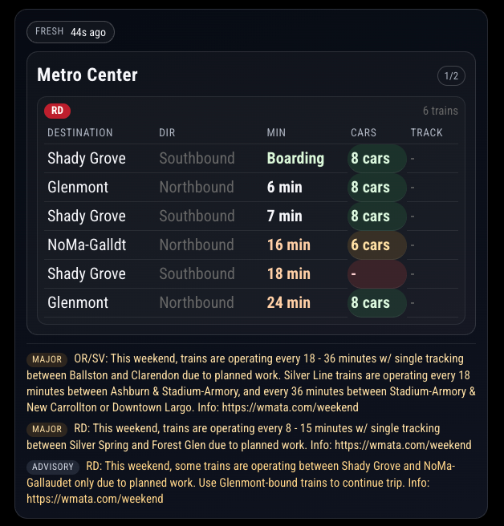
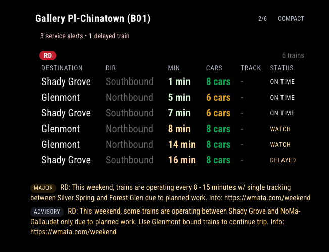
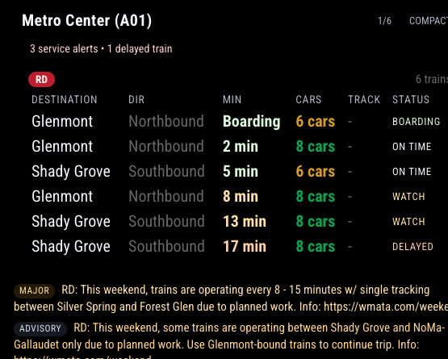

# MMM-DCMetroTrains

A full-featured [MagicMirror²](https://github.com/MagicMirrorOrg/MagicMirror) module for live Washington DC Metro train arrivals and active service alerts using the WMATA API.

## Features

- Live arrival predictions for one or more WMATA station codes
- Per-station favorites and overrides for line filters, row counts, grouping, and compact display
- Station rotation mode for multi-station setups
- Route-aware grouping by line with sorted arrivals underneath each line header
- Next-train summary strip for a fast commute glance
- Line filtering (show only selected rail lines)
- Destination filtering (keyword includes)
- Optional display controls for direction, cars, track, and status badges
- Color-coded car counts that highlight longer and shorter consists
- Service alert severity filtering and custom keyword alerts
- Optional incident ticker scrolling and row caps
- Active Metro service incidents panel
- Freshness indicators and relative "last updated" timestamp
- Commute / peak-hour compact mode
- Quiet-hours mode for lower-motion overnight display
- Custom line order, station title formatting, and configurable thresholds
- Debug overlay and custom fallback messages
- Optional MetroBus stop predictions section
- Optional weather row when coordinates are provided
- Automatic retries when the API fails

Release line `1.0.6` is a cleanup release.

## Requirements

1. A working MagicMirror² installation.
2. A WMATA API key from: https://developer.wmata.com/

This module will not function without a valid API key.

## Changelog

See [CHANGELOG.md](CHANGELOG.md) for full release history.

## Installation

Using MagicMirror Package Manager (MMPM):

```bash
mmpm install MMM-DCMetroTrains
```

Then restart MagicMirror.

Using git from your MagicMirror `modules` folder:

```bash
git clone https://github.com/rroach3753/MMM-DCMetroTrains.git
cd MMM-DCMetroTrains
npm install
```

If you copied this folder manually, place it at:

```text
MagicMirror/modules/MMM-DCMetroTrains
```

## Update

Using MMPM:

```bash
mmpm update MMM-DCMetroTrains
```

Using git from your module folder:

```bash
cd MMM-DCMetroTrains
git pull
npm install
```

Restart MagicMirror after updating.

## Example Config

Add this to your `config/config.js` file:

```js
{
  module: "MMM-DCMetroTrains",
  position: "top_right",
  config: {
    apiKey: "YOUR_WMATA_API_KEY",
    stationCodes: [
      "A01",
      {
        code: "C01",
        name: "Favorite Station",
        lineFilter: ["RD", "BL"],
        destinationIncludes: ["Glenmont"],
        maxRows: 5,
        compact: true,
        groupByLine: true
      }
    ],
    refreshInterval: 30000,
    incidentsRefreshInterval: 120000,
    stationRotationInterval: 15000,
    maxRows: 7,
    summaryCount: 3,
    lineFilter: ["RD", "OR", "SV", "BL", "YL", "GR"],
    lineOrder: ["RD", "BL", "OR", "SV", "YL", "GR", "NA"],
    destinationIncludes: [],
    alertRules: ["Glenmont", "single track"],
    hideWhenNoTrains: false,
    onlyShowAlertsForVisibleLines: true,
    maxIncidentRows: 2,
    incidentScroll: false,
    incidentScrollSpeed: 28,
    etaColorMode: "gradient",
    carsColorMode: "wmata",
    statusThresholds: {
      watchMinutes: 8,
      delayedMinutes: 15,
      criticalMinutes: 25
    },
    stationTitleFormat: "nameWithCode",
    quietHours: {
      weekdays: [
        { start: "22:00", end: "23:59" },
        { start: "00:00", end: "05:30" }
      ],
      weekends: [
        { start: "23:00", end: "23:59" },
        { start: "00:00", end: "06:30" }
      ]
    },
    blinkOnCritical: true,
    updateJitterMs: 2500,
    debugOverlay: false,
    fallbackMessage: "No trains right now",
    fontScale: 1,
    showIncidents: true,
    incidentSeverityFilter: "all",
    showHeader: true,
    showBorders: true,
    showBackground: true,
    showConditions: true,
    showLastUpdated: true,
    showFreshnessChip: true,
    showCars: true,
    showCarHighlights: false,
    showDirection: true,
    showStationCode: false,
    showStatus: true,
    showNextSummary: true,
    showMetroBus: false,
    metroBusOnlyMode: false,
    showMetroBusHeader: true,
    metroBusStops: [
      "1001195",
      {
        stopId: "1001436",
        name: "14th St & Irving",
        routeFilter: ["52", "54"],
        maxRows: 4
      }
    ],
    metroBusMaxRows: 5,
    metroBusRouteFilter: [],
    showWeather: false,
    weatherLatitude: null,
    weatherLongitude: null,
    rotateStations: true,
    groupByLine: true,
    commuteMode: true,
    commuteSchedule: {
      weekdays: [
        { start: "06:00", end: "09:30" },
        { start: "15:30", end: "19:00" }
      ],
      weekends: []
    },
    autoCompact: true,
    commuteMaxRows: 5,
    compact: false
  }
}
```

## Configuration Options

Only one setting is required:

- `apiKey` must be set to a valid WMATA API key.

All other settings are optional and fall back to the defaults shown below.

| Option | Type | Required? | Default | What it does |
| --- | --- | --- | --- | --- |
| `apiKey` | String | Yes | `""` | WMATA API key used for all API requests. Module will show an error until this is set. |
| `stationCodes` | Array<String or Object> | No | `["A01"]` | Station codes to query. Each entry can be a string code or an object with per-station overrides such as `name`, `lineFilter`, `destinationIncludes`, `maxRows`, `compact`, `groupByLine`, `showIncidents`, and `alerts`. |
| `refreshInterval` | Number | No | `30000` | How often train predictions refresh, in milliseconds. |
| `incidentsRefreshInterval` | Number | No | `120000` | How often service incidents refresh, in milliseconds. |
| `retryDelay` | Number | No | `15000` | Wait time before retrying after a failed predictions request. |
| `stationRotationInterval` | Number | No | `20000` | Time each station remains visible before rotating to the next station. |
| `maxRows` | Number | No | `8` | Maximum number of train rows rendered per station card. |
| `summaryCount` | Number | No | `3` | Number of upcoming trains shown in the summary strip. |
| `lineFilter` | Array<String> | No | `[]` | Optional line filter. Empty means all lines. Example values: `RD`, `OR`, `SV`, `BL`, `YL`, `GR`. |
| `lineOrder` | Array<String> | No | `["RD", "OR", "SV", "BL", "YL", "GR", "NA"]` | Custom line display order used for grouped sections. |
| `destinationIncludes` | Array<String> | No | `[]` | Optional destination keyword filter (case-insensitive). Empty means all destinations. |
| `alertRules` | Array<String> | No | `[]` | Keyword list for custom alerts. If a keyword matches an arrival or service alert, the station card shows an alert badge. |
| `hideWhenNoTrains` | Boolean | No | `false` | Hides station cards with no current train predictions. |
| `onlyShowAlertsForVisibleLines` | Boolean | No | `false` | Restricts incident panel items to lines currently visible in station predictions. |
| `maxIncidentRows` | Number | No | `3` | Maximum number of incident rows shown in the incident panel. |
| `incidentScroll` | Boolean | No | `false` | Enables a horizontal ticker-style incident scroll mode. |
| `incidentScrollSpeed` | Number | No | `28` | Incident ticker cycle duration in seconds (higher is slower). |
| `etaColorMode` | String | No | `status` | ETA coloring mode: `off`, `status`, or `gradient`. |
| `carsColorMode` | String | No | `wmata` | Car badge coloring mode: `wmata`, `capacity`, or `off`. WMATA uses plain line colors; `capacity` keeps the older filled highlight-style look. |
| `statusThresholds` | Object | No | `{ watchMinutes: 8, delayedMinutes: 15, criticalMinutes: 25 }` | Minute thresholds for status classification and ETA highlighting. |
| `stationTitleFormat` | String | No | `name` | Station title format: `name`, `code`, or `nameWithCode`. |
| `quietHours` | Object | No | see defaults in module | Quiet-time windows to reduce motion and suppress lower-priority summary chips. |
| `blinkOnCritical` | Boolean | No | `false` | Adds a subtle pulse effect when critical incidents are active. |
| `updateJitterMs` | Number | No | `0` | Adds random refresh jitter (+/- ms) to reduce synchronized API bursts. |
| `debugOverlay` | Boolean | No | `false` | Shows a compact debug line with station, row, incident, and mode counters. |
| `fallbackMessage` | String | No | `"No upcoming trains."` | Custom message used when no predictions are available. |
| `fontScale` | Number | No | `1` | Scales module text size. Example: `0.9`, `1`, `1.1`. |
| `showIncidents` | Boolean | No | `true` | Shows or hides Metro incident messages panel. |
| `incidentSeverityFilter` | String | No | `all` | Filters incident items by severity. Use `all`, `advisory`, `major`, or `critical`. Advisories will also show a date-range chip when WMATA includes start and end dates. |
| `showHeader` | Boolean | No | `true` | Shows or hides station name header row. |
| `showBorders` | Boolean | No | `true` | Shows or hides border/card chrome around the module and station sections. Use boolean values (`true` / `false`). |
| `showBackground` | Boolean | No | `true` | Shows or hides translucent panel backgrounds behind the module and cards. |
| `showConditions` | Boolean | No | `true` | Shows or hides the transit conditions row. |
| `showLastUpdated` | Boolean | No | `true` | Shows or hides relative "updated x ago" timestamp. |
| `showFreshnessChip` | Boolean | No | `true` | Shows or hides the top summary chip labeled `Fresh` or `Stale`. |
| `showCars` | Boolean | No | `true` | Shows or hides the train car-count column. Car badges are color-coded by train length. |
| `showCarHighlights` | Boolean | No | `false` | Switches car badges to the older filled highlight-style format instead of the WMATA color palette. |
| `showDirection` | Boolean | No | `true` | Shows or hides the direction column (northbound/southbound). |
| `showStationCode` | Boolean | No | `false` | Shows or hides station code chip in the header. |
| `showStatus` | Boolean | No | `true` | Shows or hides the status badge column. |
| `showNextSummary` | Boolean | No | `true` | Shows or hides the top-of-card next-train summary strip. |
| `showMetroBus` | Boolean | No | `false` | Enables the MetroBus predictions section. Off by default. |
| `metroBusOnlyMode` | Boolean | No | `false` | MetroBus-only compact mode. Hides rail cards/incidents and shows only MetroBus content in a tighter layout. |
| `showMetroBusHeader` | Boolean | No | `true` | Shows or hides the MetroBus section header label. |
| `metroBusStops` | Array<String or Object> | No | `[]` | MetroBus stop IDs. Supports string IDs or object entries with `stopId`, `name`, `routeFilter`, `maxRows`, and `priority`. |
| `metroBusMaxRows` | Number | No | `5` | Maximum buses shown per stop card (unless a stop-level `maxRows` overrides it). |
| `metroBusRouteFilter` | Array<String> | No | `[]` | Global MetroBus route filter; empty means all routes. |
| `showWeather` | Boolean | No | `false` | Shows or hides the weather summary row when latitude and longitude are provided. |
| `weatherLatitude` | Number | No | `null` | Latitude used for optional weather lookup. |
| `weatherLongitude` | Number | No | `null` | Longitude used for optional weather lookup. |
| `staleAfterSeconds` | Number | No | `180` | Time threshold used to mark the feed as stale in the freshness indicators. |
| `rotateStations` | Boolean | No | `true` | Enables station rotation when more than one station is configured. |
| `groupByLine` | Boolean | No | `true` | Groups arrivals by rail line instead of showing one flat table. |
| `commuteMode` | Boolean | No | `true` | Enables commute-aware UI behavior such as the peak-hour summary chip and auto-compact logic. |
| `commuteSchedule` | Object | No | `{ weekdays: [...], weekends: [] }` | Defines commute windows. Each window uses `{ start: "HH:MM", end: "HH:MM" }`. |
| `autoCompact` | Boolean | No | `true` | Uses compact styling automatically during commute windows. |
| `commuteMaxRows` | Number | No | `5` | Maximum rows shown during commute/compact windows. |
| `compact` | Boolean | No | `false` | Forces the compact layout at all times. |
| `animationSpeed` | Number | No | `1000` | DOM update animation speed in milliseconds. |

## Notes

- Direction labels are derived from WMATA group values (`1` = Northbound, `2` = Southbound).
- If incidents fail to load, train predictions continue to update normally.
- Car badges are color-coded to give a quick sense of train length at a glance.
- If you want station-specific behavior, use object entries inside `stationCodes` instead of only string codes.
- For best results, keep `refreshInterval` at 20-60 seconds to avoid excessive API usage.

## Advanced Configuration Guide

This module is designed to work in layers. Think of the config as a stack where global settings apply first, and then each station can override a subset of them.

### 1. Global settings versus station overrides

Use top-level config values when you want the same behavior for every station card.

Use an object inside `stationCodes` when one station needs special handling.

Example:

```js
stationCodes: [
  "B35",
  {
    code: "C01",
    name: "My Regular Stations",
    lineFilter: [],
    destinationIncludes: [],
    maxRows: 5,
    compact: true,
    groupByLine: true
  }
]
```

In that example:
- `B35` uses the module-wide defaults.
- `C01` gets its own card title, row count, compact layout, and grouping behavior.

### 2. How station objects are merged

When you use an object inside `stationCodes`, the module reads the following station-specific values first:
- `name`
- `lineFilter`
- `destinationIncludes`
- `maxRows`
- `compact`
- `groupByLine`
- `showIncidents`
- `alerts`
- `priority`

If a value is not present in the station object, the module falls back to the matching global setting.

Important:
- `lineFilter: []` means no line filtering for that station.
- `destinationIncludes: []` means no destination filtering for that station.
- `showIncidents` can be disabled for one station while staying enabled for the rest.

### 3. Filtering order

The module filters trains in this order:
1. WMATA data is loaded for the configured stations.
2. Global line and destination filters are applied.
3. Station-level line and destination filters are applied.
4. The remaining trains are grouped, sorted, and displayed.

That means a station object can narrow the global data set, but it cannot re-add trains that the global filters already removed.

### 4. Grouped versus flat display

`groupByLine: true` groups the arrivals under each line badge.

`groupByLine: false` shows a flat table.

This can be set globally or per station:
- Global `groupByLine` sets the default.
- Station-level `groupByLine` overrides it for that one card.

### 5. Compact and commute behavior

There are three related layout controls:
- `compact`: forces compact layout all the time.
- `autoCompact`: switches to compact layout only during commute windows.
- `commuteMode`: enables the commute-window logic that drives the summary chip and compact mode.

Recommended pattern:
- Leave `commuteMode: true`.
- Set `autoCompact: true` if you want the module to tighten up during commute periods.
- Use `compact: true` only if you always want the smaller layout.

### 6. Quiet hours

`quietHours` is useful when the mirror is in a bedroom, hallway, or other low-motion environment.

During quiet hours the module reduces visual noise by suppressing or minimizing some summary chips and animations. It does not stop live data updates.

Typical use:
- Keep daytime behavior normal.
- Add late-night and early-morning windows in `quietHours.weekdays` and `quietHours.weekends`.

### 7. Incident controls

These options control service alerts and how much room they take:
- `showIncidents`: master on/off switch for the incident section.
- `incidentSeverityFilter`: controls which severities are shown.
- `onlyShowAlertsForVisibleLines`: only show alerts that match the lines currently visible in the station predictions.
- `maxIncidentRows`: limits how many incident messages are shown.
- `incidentScroll`: switches long incident text into a ticker-style scroll.
- `incidentScrollSpeed`: controls how fast that ticker cycles.

Suggested setup:
- Use `incidentSeverityFilter: "major"` or `"critical"` if you only want more serious disruptions.
- Use `onlyShowAlertsForVisibleLines: true` if you want the alerts panel to stay relevant to your commute.
- Keep `maxIncidentRows` low if the module is taking up too much vertical space.

### 8. Styling controls

These options change the visual treatment rather than the data:
- `showBorders`: removes module/card outlines when set to `false`.
- `showBackground`: removes the translucent panel backgrounds when set to `false`.
- `fontScale`: scales the whole module text size.
- `showFreshnessChip`: hides the top freshness chip.
- `showLastUpdated`: hides the bottom relative timestamp.

Useful combinations:
- Minimal card: `showBorders: false`, `showBackground: false`
- Soft card: `showBorders: false`, `showBackground: true`
- Dense display: `compact: true`, `fontScale: 0.9`

### 9. ETA and car color modes

`etaColorMode` and `carsColorMode` let you change how arrival urgency and car counts look:

- `etaColorMode: "status"` colors ETAs based on the module’s status classification.
- `etaColorMode: "gradient"` uses minute thresholds from `statusThresholds`.
- `etaColorMode: "off"` removes special ETA coloring.

- `carsColorMode: "wmata"` uses the default plain-color WMATA palette.
- `carsColorMode: "capacity"` colors badges by count/capacity logic and keeps the filled badge look.
- `carsColorMode: "off"` turns off special car coloring.

If you want the older filled highlight-style badges without changing the color mode explicitly, set `showCarHighlights: true`.

If you want the module to match a specific visual theme, the most common pairing is:
- `etaColorMode: "gradient"`
- `carsColorMode: "wmata"`

### 10. Status thresholds and line order

`statusThresholds` changes what the module considers watch, delayed, and critical.

Example:

```js
statusThresholds: {
  watchMinutes: 8,
  delayedMinutes: 15,
  criticalMinutes: 25
}
```

Use this when your local travel patterns make the default thresholds too aggressive or too relaxed.

`lineOrder` controls the order used when arrivals are grouped by line.

Example:

```js
lineOrder: ["RD", "BL", "OR", "SV", "YL", "GR", "NA"]
```

That example places Red and Blue ahead of the others, regardless of the default WMATA ordering.

### 11. Title and fallback text

`stationTitleFormat` controls how the card title is displayed:
- `name` shows the station name.
- `code` shows only the station code.
- `nameWithCode` shows both.

`fallbackMessage` changes the text shown when no arrivals are available.

Use this if you want a friendlier message like:
```js
fallbackMessage: "No trains right now"
```

### 12. Debugging and refresh pacing

`debugOverlay: true` adds a small diagnostic line to the bottom of the module showing counts and mode state.

`updateJitterMs` adds a small random offset to refresh timing. This is useful if you run multiple mirrors or multiple transit modules and want to avoid all of them hitting the API at the exact same second.

Recommended values:
- `updateJitterMs: 0` for a single mirror or if you want fixed timing.
- `updateJitterMs: 1000` to `3000` if you want softer refresh synchronization.

### 13. MetroBus setup (optional)

MetroBus is disabled by default (`showMetroBus: false`).

To enable it, set:

```js
showMetroBus: true,
metroBusStops: ["1001195", "1001436"]
```

You can also use object entries for per-stop overrides:

```js
metroBusStops: [
  "1001195",
  {
    stopId: "1001436",
    name: "14th St & Irving",
    routeFilter: ["52", "54"],
    maxRows: 4
  }
]
```

MetroBus behavior rules:
- Global `metroBusRouteFilter` applies first.
- Stop-level `routeFilter` can narrow routes for that stop.
- Global `metroBusMaxRows` is the default row count.
- Stop-level `maxRows` overrides global row count for that stop.
- `showMetroBusHeader` controls the section title only.

MetroBus-only compact mode:

```js
showMetroBus: true,
metroBusOnlyMode: true,
metroBusStops: ["1001195", "1001436"]
```

When `metroBusOnlyMode` is enabled, the module hides rail station cards and rail incidents, and renders only MetroBus in compact layout.

### 14. Station code best practice

For the simplest setup, use only station code strings:

```js
stationCodes: ["A01", "C01"]
```

Use station objects only when you need per-station differences.

That keeps the config easier to read and reduces the chance of accidentally overriding a setting you meant to keep global.


## Screenshots

1. Boarder and Background Enabled, Cars highlighted


2. Boarder and Background Disabled, Cars highlighted


3. Boarder and Background Disabled, Cars not highlighted
